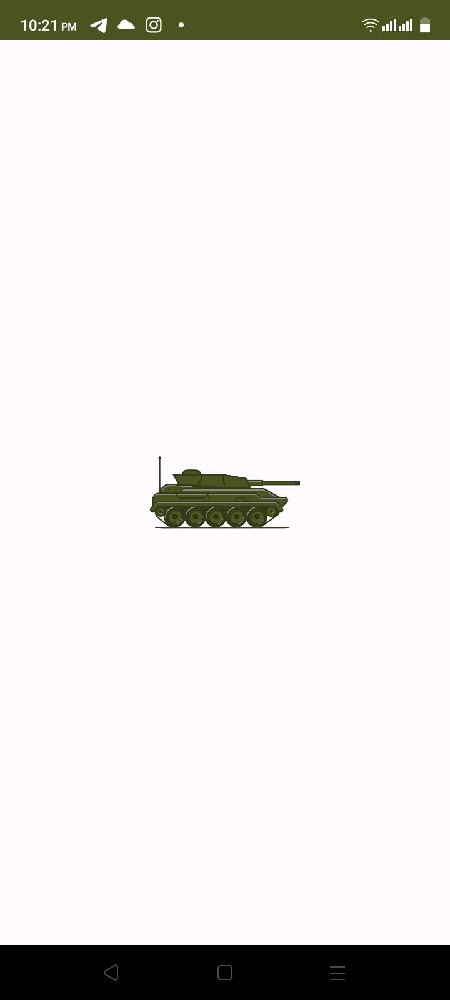
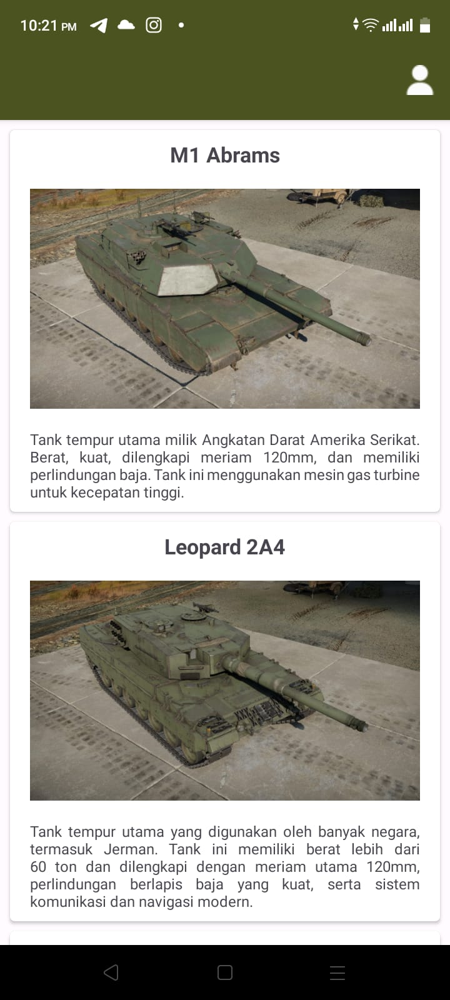
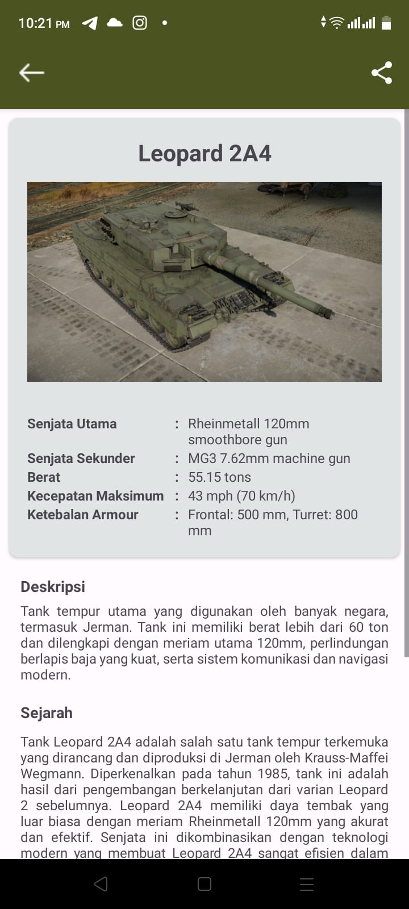

# Proyek Submission Dicoding: Aplikasi Showcase Tank dengan rating ⭐⭐⭐⭐⭐ (5/5)
Aplikasi Android ini dikembangkan sebagai bagian dari submission Dicoding untuk kursus "Membuat Aplikasi Android untuk Pemula." Proyek ini mencakup konsep dan keterampilan dasar bagi pengembang Android pemula, termasuk RecyclerView, pemuatan gambar dengan Glide, dan banyak lagi.

## Gambaran Umum

Aplikasi Showcase Tank dirancang untuk menampilkan berbagai aspek tentang tank, menjadikannya sumber daya berharga bagi para penggemar tank dan siapa saja yang ingin belajar tentang kendaraan berperisai ini. Aplikasi ini menawarkan antarmuka yang mudah digunakan dengan kumpulan informasi dan gambar terkait tank.

## Screenshots

    
ScreenShot Aplikasi

     
    

        
        
        
    

## Fitur-fitur

- **RecyclerView**: Aplikasi ini menggunakan RecyclerView untuk menampilkan daftar tank secara efisien dalam format yang dapat digulirkan, sehingga memberikan pengalaman pengguna yang lancar dan responsif.

- **Integrasi Glide**: Gambar-gambar tank dimuat secara mulus menggunakan perpustakaan Glide, meningkatkan kinerja aplikasi dan kemampuan penyimpanan cache gambar.

- **Detail Tank**: Pengguna dapat mengetuk tank tertentu untuk mengakses informasi terperinci tentangnya, termasuk spesifikasi, sejarah, dan gambar.
- 
- **Share**: Pengguna dapat membagikan informasi mengenai tank yang sedang dibuka.

- **Desain Ramah Pengguna**: Aplikasi ini memiliki desain yang intuitif dan ramah pengguna untuk memastikan pengalaman pengguna yang menyenangkan.

## Memulai

Untuk memulai proyek ini, ikuti langkah-langkah berikut:

1. Clone repositori ini ke lokal Anda.

2. Buka proyek di Android Studio.

3. Build dan jalankan aplikasi di emulator Android atau perangkat fisik.

## Contributors ✨
<table>
  <tr>
    <td align="center"><a href="https://github.com/EriSetyawan166"> <b>Muhammad Eri Setyawan</b></a> <a href="#" title="Code">💻</a> <a href="#" title="Documentation">📖</td>
  </tr>
</table>

